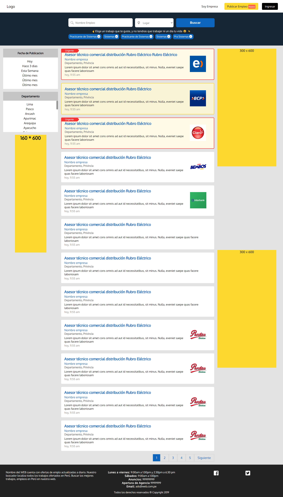
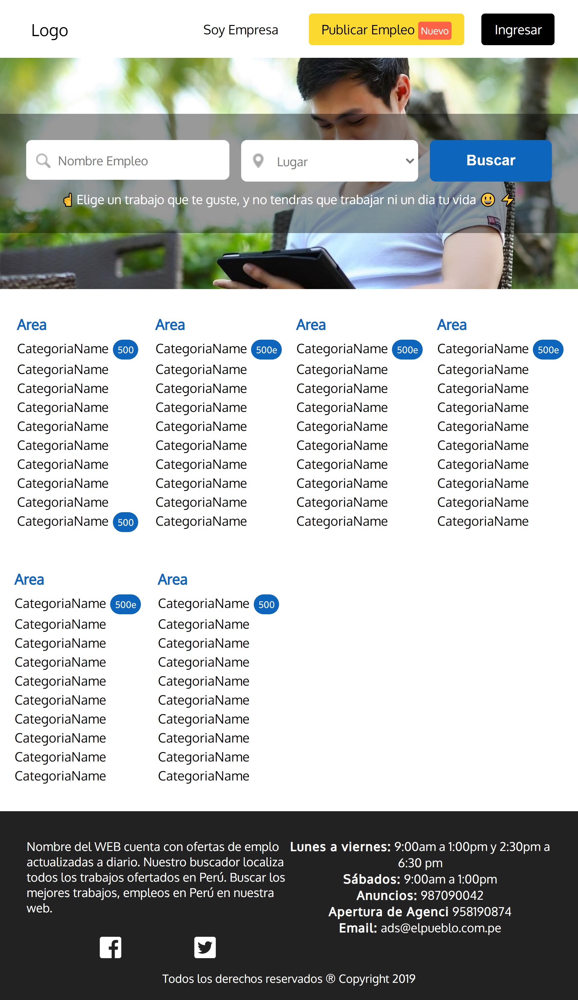
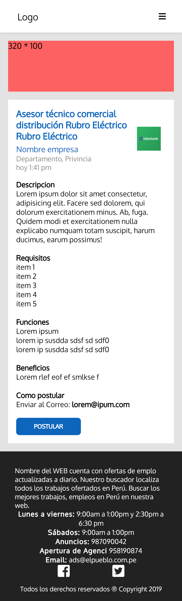

# GoEmpleo-Maquetacion
Lo compilaba con Node sass, aun no utilizaba webpack.

## SASS
-Abstracts
-Base
-Components
-Layout
-Pages
-main.scss

## Responsive Web Design
Aprendi muchos conceptos como Grid y Flex.

